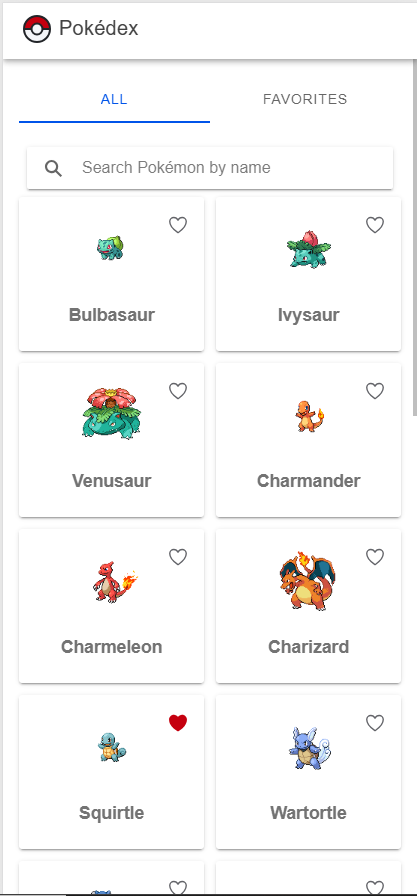
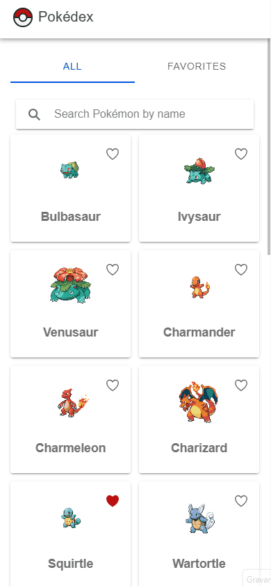
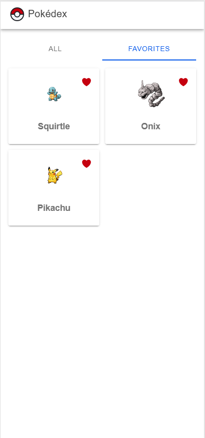
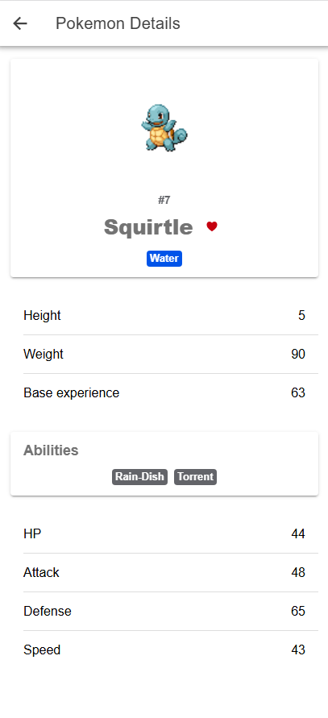

# Pokédex

Aplicação desenvolvida com Ionic e Angular consumindo a PokeAPI como parte de um teste técnico.

## Funcionalidades

- Exibição dos Pokémon com nome e imagem na página inicial.
- Busca de Pokémon pelo nome.
- Carregamento automático de novos Pokémon conforme o usuário percorre a lista.
- Tela de detalhes com tipos, altura, peso, experiência base, habilidades e estatísticas.
- Opção de favoritar e desfavoritar Pokémon, mantendo as escolhas salvas mesmo após fechar a aplicação.
- Navegação entre a listagem completa e os Pokémon favoritos.
- Mensagens visuais durante o carregamento dos dados e quando ocorre algum erro.
- Interface responsiva para diferentes tamanhos de tela.

## Demonstração

| Listagem e busca | Paginação com infinite scroll |
| :---: | :---: |
|  |  |
| **Favoritos** | **Detalhes** |
|  |  |

## Abordagem

Comecei pelo fluxo principal de listagem da PokeAPI para garantir primeiro o funcionamento da Home. Mantive o acesso à API concentrado no `PokemonService`, deixando os componentes responsáveis principalmente pelo estado e pela interface. Para as chamadas HTTP utilizei `Observable`, enquanto os Signals ficaram responsáveis pelo estado reativo das telas. Nos templates usei `@if` e `@for`, seguindo a abordagem atual do Angular. A paginação utiliza `limit` e `offset` da PokeAPI com o infinite scroll do Ionic. Os favoritos são controlados pelo `FavoritesService` e persistidos somente pelos IDs no `localStorage`. Quando o mesmo card passou a ser reutilizado nas visualizações `All` e `Favorites`, extraí o `PokemonCardComponent` para evitar duplicação. A interface foi construída seguindo uma abordagem mobile-first, com o layout se reorganizando conforme o espaço disponível.

## Tecnologias

- Angular
- Ionic
- TypeScript
- PokeAPI

## Como executar

Instale as dependências:

```bash
npm install
```

Execute a aplicação em modo de desenvolvimento:

```bash
npm start
```

Gere o build de produção:

```bash
npm run build
```

### Docker

```bash
docker compose up --build
```

A aplicação ficará disponível em `http://localhost:8080`.

## Testes

O projeto possui testes unitários para `PokemonService` e `FavoritesService`.

Para executá-los:

```bash
npm test
```

## Estrutura

```text
src/app/
├── components/
│   └── pokemon-card/
├── home/
├── pokemon-detail/
├── models/
└── services/
```

## Decisões técnicas

- `PokemonService` concentra a comunicação com a PokeAPI.
- `FavoritesService` concentra o estado e a persistência dos favoritos.
- `HttpClient` com `Observable` é usado para as chamadas HTTP.
- Signals representam o estado reativo da interface.
- Os templates usam `@if` e `@for`.
- `PokemonCardComponent` evita duplicação entre as visualizações `All` e `Favorites`.
- A paginação usa `limit` e `offset` da PokeAPI junto com `ion-infinite-scroll`.
- Os favoritos armazenam somente IDs no `localStorage`.
- O layout segue mobile-first, com grid fluido que se reorganiza conforme a largura disponível, inclusive ao mudar a orientação do dispositivo.
